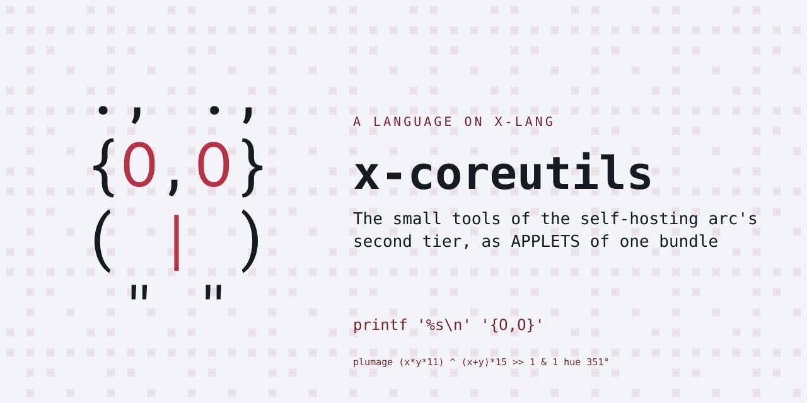
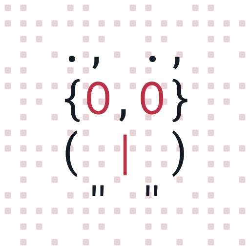

# x-coreutils

The small tools of the self-hosting arc's second tier, as APPLETS of
one bundle -- the busybox shape:

    x -l coreutils -- APPLET [args]...

**Seventy-three applets**, busybox-style -- every applet in busybox's
`coreutils` set that today's doors can reach:

    base64 basename cat cksum cmp comm cp cut date dd diff dirname
    dos2unix du echo env expand expr factor false fold head install
    join md5sum mkdir mktemp mv nl nohup od paste printenv printf pwd
    rev rm rmdir seq sha1sum sha256sum sha512sum shred shuf sleep sort
    split stat sum tac tail tee test timeout touch tr true truncate tty
    unexpand uniq unix2dos unlink uudecode uuencode usleep wc which
    xargs yes [ [[

Highlights: **every digest is byte-identical with the system tool** --
`md5sum`, `sha1sum`, `sha256sum` and `sha512sum` are the FIPS/RFC
algorithms in x, and `cksum` is the POSIX CRC-32 with its length fold;
`sort` is a merge sort with `-r -n -u`; `comm` and `join` walk sorted
inputs merge-wise; `expr` is a recursive-descent parser over the
argument list with its own anchored BRE matcher, capture groups and
all; `od` follows the GNU/busybox layout (not the BSD one macOS ships)
and collapses a repeated line to `*`; `diff` is a line LCS by DP;
`timeout` forks the command AND a watchdog, because there is no alarm
door.  Self-contained: no `(requires-lang ...)`.

## Known limits, loud not silent

  - **No chmod, chown or link doors yet**, so `touch` bumps mtime by
    rewriting bytes and `install -m` accepts-and-ignores the mode.
    The applets those doors unlock -- `chmod` `chown` `chgrp` `ln`
    `link` `readlink` `realpath` `df` `uname` `arch` `nproc` `mkfifo`
    `id` `whoami` `groups` `logname` `sync` `nice` `chroot` -- wait on
    x-lang PR #607 and the release that carries it.
  - **`date` prints ISO-8601 UTC**, not the locale format.
  - **`tty` answers isatty**, not a terminal name.
  - **`which` tests existence**, not the execute bit.
  - **Text, not binary.** An x string ends at its first NUL, so the
    digests, `base64 -d`, `dd` and `shred` are safe on text and will
    truncate a stream with an embedded NUL.
  - **`expr`'s regular expressions are its own grammar**: literals,
    `.`, `*`, bracket expressions with ranges and negation, `$`, and
    `\(...\)` capture.  No `\{n,m\}`, no `\|`, no back-references.
  - **`head`/`tail` treat multiple inputs as one stream.**
  - **Not present**, for want of a door this bundle will not invent:
    `who` (utmpx), `stty` (ioctl), `hostid`, `mknod`, `sha3sum`.

Paired with x-lang v0.10.0 (`lang.xon` is the checkable row).

## Try it

    make install        # into the x on PATH

    printf 'b\na\n' | x -l coreutils -- sort
    x -l coreutils -- sha256sum file.txt
    ... | x -l awk '{print $1}' | x -l coreutils -- sort | x -l coreutils -- uniq -c

That last line is a real pipeline of x tools, and it works today.

## Tests

    make test           # the suite, loud on any failure
    make check          # judged against tests/contract/known-failures.txt

## Layout

    lang.xon          what this bundle IS (self-contained)
    run.x             the entry: operands mean "be the applet"
    cu/prims.x        the platform layer (byte doors, bitwise, File)
    cu/text.x         cat sort uniq head tail wc comm join basename dirname
    cu/text3.x        yes factor expand unexpand dos2unix unix2dos split shuf base64
    cu/text2.x        echo printf seq rev tac nl fold paste tee
    cu/trcut.x        tr and cut
    cu/fs.x           cp rm mkdir
    cu/fs2.x          touch ls pwd mv rmdir install mktemp cmp
    cu/sys2.x         true false env printenv sleep date which xargs test
    cu/diff.x         diff, normal format (LCS by DP)
    cu/fs3.x          stat du dd truncate unlink shred timeout usleep tty nohup [[
    cu/encode.x       od uuencode uudecode
    cu/expr.x         expr, and the anchored matcher it needs
    cu/hash.x         md5sum sha1sum cksum sum
    cu/sha256.x       FIPS 180-4, in x
    cu/sha512.x       its 64-bit sibling, addition masked in halves
    cu/cli.x          the applet table, cu-run, cu-main
    tests/            markdown specs + the platform's runner, vendored nowhere

