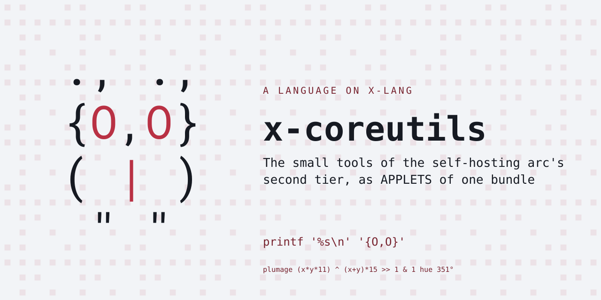
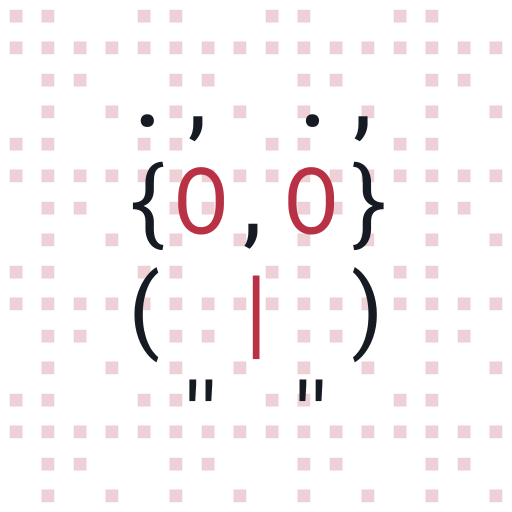

# x-coreutils

The small tools built second in the self-hosting arc, as APPLETS of
one bundle -- organized like busybox:

    x -l coreutils -- APPLET [args]...

**A hundred and thirty-eight applets: parity with busybox's `coreutils`
set, plus `join`, `find`, busybox's editor, `vi`, its pager and terminal
tools, `more`, `clear` and `reset`, `strings`, `tsort` and `cal`, its
dumpers, `hexdump`, `hd` and `xxd`, its `base32`, `crc32`, `ascii` and
`uuidgen`, its `tree` and `time`, its `fsync`, `flock`, `setsid`,
`ttysize`, `nologin` and `pipe_progress`, its `getopt` and `run-parts`,
its network tools, `wget` (http, https and ftp), `whois`, `nc`,
`nslookup`, `tftp`, `ftpget`, `ftpput` and `httpd`, its `uptime`, `free`,
`ps`, `pidof`, `pgrep` and `pkill`, its `who`, `w` and `users`, its
`tar`, and its `gzip`, `gunzip` and `zcat`.**

    arch ascii base32 base64 basename cal cat chgrp chmod chown chroot
    cksum clear cmp comm cp crc32 cut date dd df diff dirname dos2unix du
    echo env expand expr factor false find flock fold free fsync ftpget
    ftpput getopt groups gunzip gzip hd head hexdump httpd id install join
    link ln logname ls md5sum mkdir mkfifo mktemp more mv nc nice nl nohup
    nologin nproc nslookup od paste pgrep pidof pipe_progress pkill
    printenv printf ps pwd readlink realpath reset rev rm rmdir run-parts
    seq setsid sha1sum sha256sum sha512sum shred shuf sleep sort split
    stat strings sum sync tac tail tar tee test tftp time timeout touch tr
    tree true truncate tsort tty ttysize unexpand uniq unix2dos unlink
    uname uptime users uudecode uuencode uuidgen usleep vi w wc wget which
    who whois whoami xargs xxd yes zcat
    [ [[

Highlights: **every digest is byte-identical with the system tool** on
input with no NUL byte -- `md5sum`, `sha1sum`, `sha256sum` and
`sha512sum` are the FIPS/RFC algorithms in x, and `cksum` is the POSIX
CRC-32 with its length fold; `sort` is a merge sort with busybox's whole
option set, keys (`-k`, `-t`) included; `expr` is a recursive-descent
parser over the argument list with its own anchored BRE matcher,
`\(...\)` capture and all; `chmod` reads an octal mode and the whole
symbolic grammar -- `X`, `s`, `t`, a copied who and the umask
included, and `chown -R`, `cp` and `du` all take `-H`, `-L` and `-P`
for what they do with a link they meet -- `du` counting a file with
several names once, as it does; `realpath` restarts its walk
over any prefix that turns out to be a link, so `/tmp` resolves
through to `/private/tmp`; `od` follows the GNU/busybox layout (not
the BSD one macOS ships) and collapses a repeated line to `*`; `diff`
is a line LCS by DP, in the normal or the unified format; `timeout`
forks the command AND a watchdog, because there is no alarm door.
`vi` is busybox's: its screen, keys and messages, each case checked
against busybox's own vi typed the same keys; it keeps busybox's one
buffer of bytes, searches it with libc's `memchr`, `strcspn` and
`memmem`, and sweeps the heap once the objects live have grown a set
amount, so its memory stays bounded however long it runs; a refresh
formats the rows again only when what they show can have changed.
Self-contained: no `(requires-lang ...)`.

## Known limits

  - **No name service.** There is no passwd or group door.  A user's
    name comes from /etc/passwd when it holds the id, then `$USER`,
    then `$LOGNAME`, then the number itself; `logname` reads
    `$LOGNAME` first.  No group has a name: `groups`, `id`, `id -gn`
    and `id -Gn` print numbers.  `chown` and `chgrp` take numeric ids
    only, and their reports name ids where GNU's name a user and a
    group: `changed group of 'f' from 0 to 20`.
  - **`date` is in the C locale.** Times are local, in the zone TZ
    names, as busybox's are, but the locale is not read, so names print
    as `LC_ALL=C date` prints them.  `date -d` and `touch -d` read a
    date spelled as an ISO 8601 date or time or as `@SECONDS`, not in
    GNU's free-form words.
  - **`tty` answers isatty**, not a terminal name: there is no ttyname
    door, so it prints `/dev/tty` or `not a tty`.
  - **`which` tests existence**, not the execute bit.
  - **`who -a` shows the same sessions as `who`**: the platform reports the
    utmpx entries of type USER_PROCESS, so the login, boot and run-level
    entries busybox adds under -a are not there.
  - **Text, not binary.** An applet holds what it reads as a string,
    and a string's length stops at its first NUL byte, so `cat`, `od`,
    `wc`, `cmp`, `dd`, the digests and the other readers see a file or
    a stream only up to its first NUL -- `cmp` can call two different
    files the same.  What a tool *writes* carries its own count, so an
    escape that names NUL writes the byte: `printf '\0'`, `echo -e
    '\0'` and `tr a '\0'` all do.  `cp`, `mv` and `install`
    copy every byte; `sort -z`, `shuf -z` and `xargs -0` read NUL as a
    separator, and `env -0` writes it.
  - **`expr`'s regular expressions are its own grammar**: literals,
    `.`, `*`, bracket expressions with ranges and negation, `$`, and
    one `\(...\)` capture.  No `\{n,m\}`, `\+`, `\?` or `\|`, and no
    back-references.
  - **A mode that looks like an option** is refused, since the option
    guard sees it first: write `chmod a-w f`, not `chmod -w f`.
  - **`vi` has busybox's core so far**: moving (`h j k l`, the arrows,
    `0 $ ^ |`, Home, End, Return, `+ -`, `w b e W B E`, `f F t T ; ,`,
    `G gg H M L`, `%`, `{ }`, counts), scrolling (`^F ^B ^D ^U ^E ^Y`,
    the page keys, `z`), inserting (`i a A I o O`, Backspace, `^V`,
    `^D`, Insert for replace), the operators `d c y < >` over any of
    those motions and doubled for lines, `x X s D C Y r R J ~ U`,
    Delete, `p P`, the registers `"a` to `"z`, the marks `m` and `'` with `''`,
    `ZZ`, `ZQ`, searching with `/ ? n N` (for the text, as busybox's
    default build does, not a regular expression), and the colon
    commands over busybox's addresses (`. $ + - 'a /text/ ?text? %`,
    `,` and `;`): a line number, `:d :y :l := :s`, `:w :wq :x :wn`,
    `:r :e :f` with `%` and `#`, and `:q :n :prev :rew`; `:set` and
    busybox's options, `ai et fl ic sm ts` (autoindent, expandtab,
    flash, ignorecase, showmatch, tabstop); `:!`, a command run by
    libc's `system` as busybox runs it; and `u` and `.`, busybox's undo
    stack with its queue of typing and its repeat of the last change.
    It takes busybox's `-c CMD` (again and again), `-R`, `-H` and `-h`,
    and runs `$EXINIT`, or a `~/.exrc` of the user's own, before the first
    file.  A command busybox's vi does not have answers `is not
    implemented`, as busybox's does.  `-H` and `-h` give busybox's usage
    without the banner naming its binary, and `:version` gives the version
    x-coreutils was installed as (the `version` file `make install`
    writes; `dev` in a checkout), where busybox's gives its own.  A
    message wider than the screen waits for one Return, where busybox's
    waits again after every Return and takes no more commands.  It
    catches busybox's signals: a window resized (SIGWINCH) is measured
    and drawn again, `^Z` (SIGTSTP) gives the terminal back and stops,
    and `^C` (SIGINT) goes back to the top of the file in command mode;
    when neither the terminal nor `$LINES` and `$COLUMNS` say how big
    the window is, it asks the terminal.  SIGWINCH and SIGTSTP are
    answered when vi next waits for a key, where busybox's handlers
    answer them at once, so the two differ only while a long command
    runs.
  - **Not present**: `stty` (ioctl), `hostid`
    (gethostid) and `mknod` (device numbers), for want of a door this
    bundle will not invent; and `sha3sum`, which needs no door and is
    not written.

Paired with x-lang v0.26.0 (`lang.xon` is the checkable row).

## Try it

    make install        # into the x on PATH

    printf 'b\na\n' | x -l coreutils -- sort
    x -l coreutils -- sha512sum file.txt
    x -l coreutils -- stat -c '%n %s %A' file.txt
    ... | x -l awk '{print $1}' | x -l coreutils -- sort | x -l coreutils -- uniq -c

That last line is a real pipeline of x tools, and it works today.

## Options

Applet parity is one axis; OPTION parity is the other.  `docs/options.md`
is the generated matrix -- every busybox option per applet, which of them
this bundle accepts, and what is missing.  `make options` regenerates it
from `docs/busybox-options.x` and the option DECLARATION in `cu/options.x`
-- the one row per applet that the guard checks and the applet reads,
parsed by x-lang's `Opts`.

## Tests

    make test           # the suite, loud on any failure
    make check          # judged against tests/contract/known-failures.txt

## Layout

    lang.xon          what this bundle IS (self-contained)
    run.x             the entry: operands mean "be the applet"
    cu/base.x         the files below, assembled into the one bundle
    cu/prims.x        the platform layer (byte doors, bitwise, File, the wide stat)
    cu/text.x         head tail wc comm join basename dirname
    cu/text2.x        echo printf seq rev tac fold paste tee
    cu/text3.x        yes factor expand unexpand dos2unix unix2dos split shuf base64
    cu/text4.x        uniq nl
    cu/fmt-lex.x      one reader for the format strings of printf, date and stat
    cu/sort.x         sort
    cu/trcut.x        tr and cut
    cu/fs.x           cat cp mv rm mkdir rmdir ln
    cu/fs2.x          touch pwd install mktemp cmp
    cu/fs3.x          stat du dd truncate unlink shred timeout usleep tty nohup
    cu/ls.x           ls
    cu/walk.x         the directory walk the recursive applets share
    cu/sys2.x         true false env printenv sleep which xargs
    cu/test.x         test, [ and [[: the expression grammar
    cu/date.x         date, and the strftime it needs
    cu/perm.x         chmod chown chgrp link readlink realpath mkfifo df sync
    cu/who.x          id whoami logname groups uname arch nproc nice chroot,
                      who w users
    cu/encode.x       od uuencode uudecode
    cu/expr.x         expr, and the anchored matcher it needs
    cu/diff.x         diff, normal and unified formats (LCS by DP)
    cu/diff-lex.x     which lines diff counts the same under -i -b -w
    cu/find.x         find: the expression grammar, and the walk it drives
    cu/hash.x         md5sum sha1sum cksum sum
    cu/sha256.x       FIPS 180-4, in x
    cu/sha512.x       its 64-bit sibling, addition masked in halves
    cu/vi.x           vi: busybox's editor -- its buffer, screen, keys, files
    cu/vi-move.x      vi's motions: words, characters, lines, brackets, scrolling
    cu/vi-edit.x      vi's operators over those motions, registers, marks
    cu/vi-ex.x        vi's search and : commands, over busybox's addresses
    cu/vi-set.x       vi's options: :set, and what ai et fl ic sm ts do
    cu/vi-undo.x      vi's u and .: the undo stack and the keys . replays
    cu/more.x         more, the pager, and clear and reset, the terminal tools
    cu/tsort.x        tsort: Kahn's algorithm over busybox's array of nodes
    cu/strings.x      strings: printable runs, found by libc's strspn
    cu/cal.x          cal: a month or a year, Julian to 1752
    cu/net.x          wget, over the platform's Http, and whois, over its Socket
    cu/nc.x           nc: busybox's netcat 1.10, the copy waiting on the platform's poll
    cu/dns.x          nslookup: busybox's DNS client, its queries and replies in x
    cu/tftp.x         tftp: busybox's client, blocks and options over UDP datagrams
    cu/ftp.x          ftpget, ftpput and wget's ftp:// urls: busybox's FTP over a passive data connection
    cu/dump.x         busybox's dump engine: hexdump's format language, blocks, * lines
    cu/hexdump.x      hexdump, hd and xxd over it, and xxd -r
    cu/tree.x         tree: the directories drawn, as busybox draws them
    cu/time.x         time: a command run, and its rusage from wait4
    cu/base32.x       base32: five bytes to eight characters, and back
    cu/ascii.x        ascii, crc32 (the zlib CRC-32) and uuidgen
    cu/session.x      fsync, flock, setsid, ttysize, nologin, pipe_progress
    cu/httpd.x        httpd: busybox's web server -- files, httpd.conf, ranges, ETags, inetd mode or a listener
    cu/getopt.x       getopt, over musl's getopt_long, and the shell's quoting
    cu/runparts.x     run-parts: a directory's scripts, in order
    cu/tar.x          tar: ustar archives listed, extracted and made, z through gzip
    cu/gzip.x         gzip, gunzip and zcat, a piece at a time through Zlib's streams
    cu/procps.x       uptime, free, ps, pidof, pgrep and pkill, over the Host
    cu/options.x      each applet's option declaration and help text
    cu/cli.x          the applet table, the option parse, cu-run, cu-main
    tests/            markdown specs + the platform's runner, vendored nowhere

